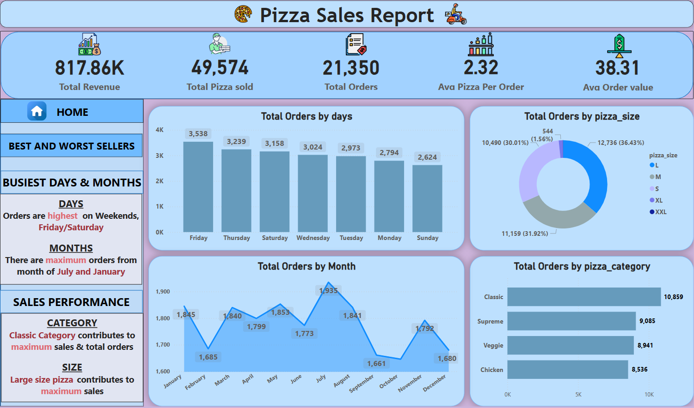
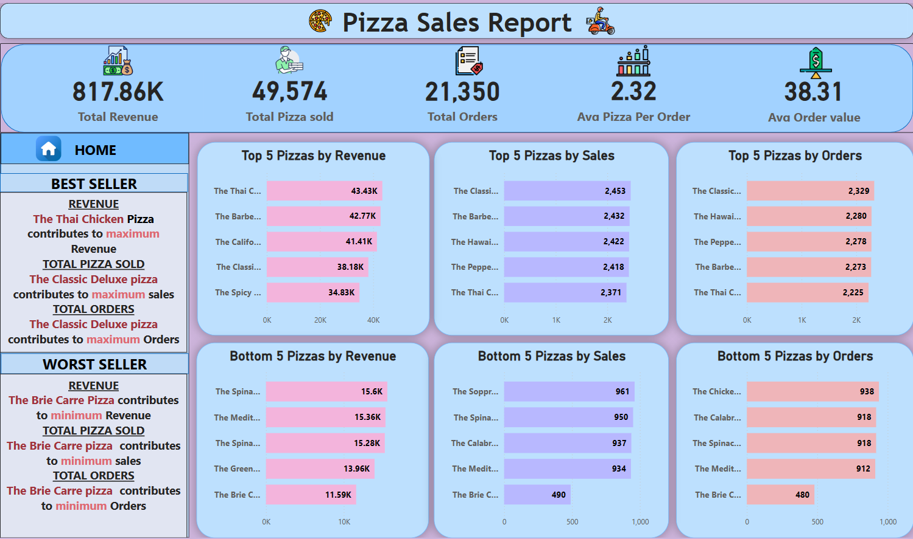

# Pizza_sales_Report_Power_BI_dashboard

Welcome to the **Pizza Sales Report** repository! This repository contains all the necessary files and documentation to understand and replicate the Power BI dashboard designed to analyze pizza sales performance. The dashboard provides insights into total revenue, sales trends, best and worst selling pizzas, and more. 

## Dashboard Overview

The Power BI dashboard offers a comprehensive view of pizza sales data. Below is a high-level summary of the key metrics and visualizations included in the dashboard:

### Key Metrics
- **Total Revenue**: $817.86K
- **Total Pizza Sold**: 49,574 units
- **Total Orders**: 21,350
- **Average Pizza Per Order**: 2.32
- **Average Order Value**: $38.31

### Visualizations
1. **Total Orders by Days**: A bar chart showing the distribution of orders across the week, with the highest orders on Friday and Saturday.
2. **Total Orders by Month**: A line chart displaying monthly order trends, with peaks in January and July.
3. **Total Orders by Pizza Size**: A donut chart illustrating the proportion of orders by pizza size, with large pizzas being the most popular.
4. **Total Orders by Pizza Category**: A bar chart depicting the number of orders for each pizza category, with the Classic category leading in sales.
5. **Top 5 Pizzas by Revenue, Sales, and Orders**: Bar charts highlighting the top-performing pizzas in terms of revenue, units sold, and orders.
6. **Bottom 5 Pizzas by Revenue, Sales, and Orders**: Bar charts identifying the least popular pizzas across the same metrics.

### Insights
- **Busiest Days & Months**: Orders are highest on weekends, specifically on Fridays and Saturdays. The months of July and January see the maximum orders.
- **Sales Performance by Category and Size**: Classic category contributes the most to total sales and orders, and large-sized pizzas are the most popular.
- **Best and Worst Sellers**: The Thai Chicken Pizza generates the most revenue, while the Classic Deluxe pizza tops the list for the number of pizzas sold and total orders. The Brie Carre Pizza is the worst performer across all these metrics.

## Screenshots

### Main Dashboard View


### Detailed Insights View


## How to Access the Dashboard

You can view the live Power BI dashboard [here](https://app.powerbi.com/view?r=eyJrIjoiYTY4Nzg0Y2YtMzk1Ny00MjEwLWFjNzgtZTc2NzE2OTdkYjNjIiwidCI6IjYyNDJkZTIwLTM5YjItNGZmZS1iYWJjLTg0ODJhNTU3OWFjYyJ9).

## Repository Contents

- `Pizza_sales_dashboard.pbix`: Power BI project file that includes all the transformations, data models, and visualizations.
- `pizza_sales.csv`: Sample data file used for creating the dashboard.
- `Pizza_Sales_report.sql`: SQL script used to extract and transform the data.
- `Screenshot_main_dashboard.png`: Image of the main dashboard view.
- `Screenshot_Detailed_Insights.png`: Image of the detailed insights view.

## How to Use This Repository

1. **Clone the Repository**: 
   ```sh
   git clone https://github.com/RamachandraPawar/Pizza_sales_Report_Power_BI_dashboard.git
2. **Open the Power BI File**:
- **Open the Pizza_sales_dashboard.pbix file** in Power BI Desktop to explore the data models and visualizations.
3. **Review Data Files**: 
- Check the **pizza_sales.csv file** to understand the structure of the data used.
  4. **Run SQL Script**: 
- Use the **Pizza_Sales_report.sql script** to extract and transform the data if you are connecting to a SQL database.

## Contributing
We welcome contributions to improve the dashboard. Please follow these steps:

1. Fork the repository.
2. Create a new branch for your feature or bugfix.
3. Make your changes and commit them.
4. Push your changes to your fork.
5. Create a pull request with a detailed description of your changes.

## License
This project is licensed under the **MIT License**. See the LICENSE file for more details.

## Contact
For any questions or feedback, please open an issue in the repository or contact us at `ramupawar1630@gmail.com`.

Thank you for visiting our repository! We hope you find the Pizza Sales Report dashboard insightful and useful.

